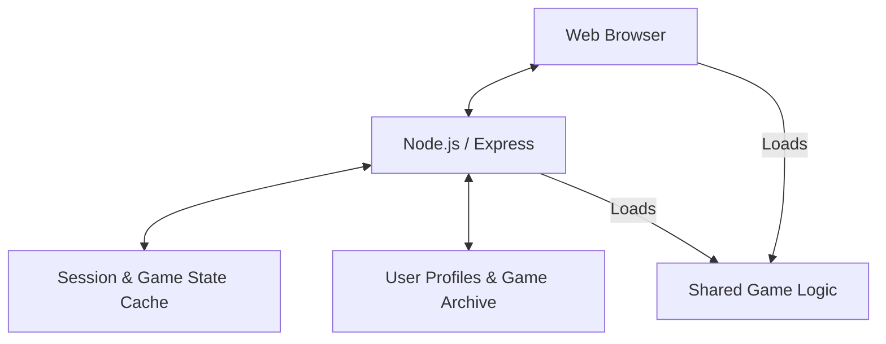

# Architecture Overview: Quoridor

This document describes the high-level architecture of the Quoridor online game.

## System Design

The project is built using a Client-Server architecture with real-time capabilities provided by Socket.IO.

### High-Level Diagram

## Key Components

### 1. Game Engine (`src/core/shared.js`)
- **Source of Truth**: Contains the logic for pawn movement, wall placement, and victory conditions.
- **Universal**: Used by both the server (to validate moves) and the client (for UI feedback and local simulation).
- **State Reducer**: Uses a functional approach (`gameReducer`) to transform state based on player actions.

### 2. Backend Server (`src/server.js`)
- **API**: Express routes for authentication (`/api/auth`) and user profiles (`/api/user`).
- **Real-time**: Socket.IO handlers for matchmaking, private rooms, and live game updates.
- **Security**: Implements JWT-like session management and rate limiting for moves.

### 3. Storage Layer (`src/storage/`)
- **Redis (`redis.js`)**: Highly efficient storage for active game states, matchmaking queues, and session data.
- **MongoDB (`db.js`)**: Persistent storage for user accounts (`User.js`) and historical game results (`GameResult.js`).

### 4. Frontend Application (`frontend/`)
- **Logic (`js/game.js`)**: Manages the local game loop, board rendering, and sound effects.
- **Networking (`js/net.js`)**: Communicates with the server via Socket.IO.
- **UI (`js/ui.js`)**: Handles DOM manipulations, animations, and localization.
- **AI (`js/ai.js` & `js/ai-worker.js`)**: Local bot logic running in a Web Worker for smooth performance.

## Data Flow

1. **Matchmaking**: Players join a queue via Socket.IO -> Server pairs them -> Initial state is created in Redis.
2. **Move In-Game**: Client suggests a move -> Server validates it using `shared.js` -> Server updates Redis -> Server broadcasts move to both players.
3. **Completion**: Server detects victory -> Saves result to MongoDB -> Cleans up Redis.

## Critical Paths
- **State Consistency**: Any change to `shared.js` must be carefully tested as it affects both ends of the application.
- **Concurrency**: Redis locks are used in `server.js` to prevent race conditions during move processing.
