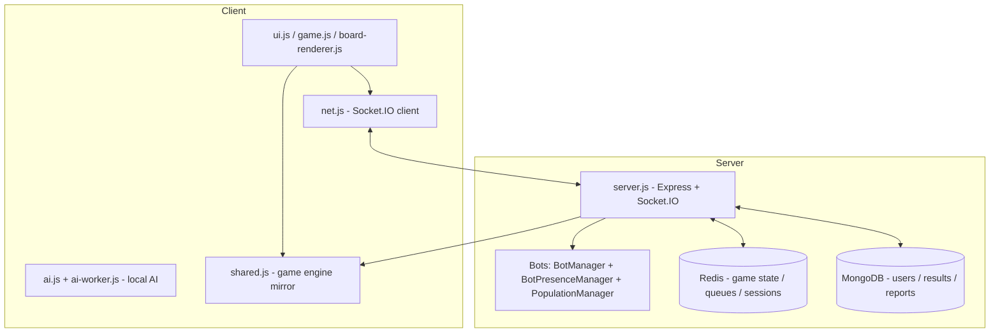

# Architecture Overview: Quoridor

System design and data flow of the Quoridor online game.

## System Design

Client-server architecture. The browser is a Socket.IO client; the server (`src/server.js`)
is the single source of truth for game state, move validation and matchmaking. All static
content (`frontend/`) is served by Express, so there is no separate web server at runtime.

```mermaid
graph TD
    subgraph Client
        UI[ui.js / game.js / board-renderer.js]
        NET[net.js - Socket.IO client]
        AIW[ai.js + ai-worker.js - local AI]
        SH[shared.js - game engine mirror]
    end
    subgraph Server
        S[server.js - Express + Socket.IO]
        RM[Bots: BotManager + BotPresenceManager + PopulationManager]
        RED[(Redis - game state / queues / sessions)]
        MON[(MongoDB - users / results / reports)]
    end
    UI --> NET
    NET <--> S
    S --> SH
    UI --> SH
    S --> RM
    S <--> RED
    S <--> MON
```

## Components

### 1. Game Engine — `src/core/shared.js`
Pure, framework-agnostic game logic (movement, jumping, wall placement, victory, timers).
Served to the browser as `/shared.js` and mirrored to clients via `index.html`/`replay.html`.
Also `src/core/ai-core.js` (served as `/js/ai-core.js`) contains the minimax bot used both
in the browser (Web Worker) and by server-side bot matchmaking.

### 2. Backend — `src/server.js` (monolith, ~3900 lines)
- **REST API**: auth, profile, avatars, friends, reports, notifications, admin, leaderboard,
  game history/replay. See [API Reference](API_REFERENCE.md).
- **Real-time**: Socket.IO handlers for matchmaking, rooms, moves, reactions, rematch,
  friend invites. See [WebSocket Protocol](WS_PROTOCOL.md).
- **Auth**: `express-session` + Redis store with secure cookies (`NODE_ENV !== 'test'`).
  User records (bcrypt-hashed passwords) live in MongoDB. Socket connections authenticate
  with a token generated at connect time (`assignToken`), then optional `userId` from the
  HTTP session.
- **Rate limiting**: per-socket/per-route limiters (moves, search, rematch, reports).
- **Security**: helmet, CORS (`ALLOWED_ORIGINS`), sanitization, `requireAdmin` middleware.

### 3. Storage Layer — `src/storage/`
- `redis.js` — wrapper over Redis for game states, finished-game TTL storage, rooms, queues,
  token↔user mapping, disconnect/turn timers, rematch contexts, bot-recent-match counters.
  Falls back to an **in-memory store** when Redis is unreachable (also used by tests).
- `db.js` — Mongo connection (env `MONGO_URI`).

### 4. Data Models — `src/models/`
`User` · `GameResult` (archive/replay) · `Friendship` · `Notification` · `Report` (bug
reports) · `UserReport` (player complaints) · `BotSettings` · `AdminLog`.

### 5. Bots & Simulation — `src/bots/`, `src/simulation/`
- `BotManager.js` — matchmaking fallback: pairs human players with bot opponents when the
  queue is empty, schedules bot moves via `AICore`.
- `BotPresenceManager.js` — simulates online presence/activity of bot accounts.
- `simulation/PopulationManager.js` — synchronizes the bot accounts (seeded from
  `defaultBots.js`) into MongoDB at startup and via the admin "seed" endpoint.

### 6. Avatars — upload pipeline
`POST /api/user/upload-avatar` → `multer` (memory, 5 MB, jpeg/png/webp) → `sharp`
(256×256, cover, WebP q80) → `avatars/<userId>.webp`. Files are served from `/avatars`
(`maxAge 365d, immutable`); a missing file 301-redirects to a ui-avatars placeholder.
The directory is backed by the `avatars_data` volume in Docker.

### 7. Frontend — `frontend/`
Vanilla-JS multi-page SPA. The shell is `index.html` loading `ui.js` (all screens),
`net.js` (Socket.IO), `game.js`/`board-renderer.js`, `shared.js`, `ai.js`+`ai-worker.js`,
`analytics.js`. Separate standalone pages: auth (login/register/forgot/reset password),
rules/faq/terms/privacy, report, leaderboard, replay, and 6 admin pages + `reports.html`.
Client files are cache-busted with `?v=x.y.z` per-file versions.

## Data Flow

1. **Matchmaking**: client emits `findGame` → server enqueues token in Redis → on a match,
   both sockets get `gameStart` (fresh lobby) — or a bot is substituted if the queue is empty
   and bot fallback is enabled.
2. **In-game move**: client emits `playerMove` → server validates with `shared.js`
   (`gameReducer`) → server persists to Redis → broadcasts `serverMove` to the lobby →
   schedules the opponent turn timer.
3. **Game over**: `finalizeGame` archives the result to MongoDB (`GameResult`), updates
   ratings/stats, saves a finished-game snapshot for replay (5 min TTL), clears the game from
   Redis and saves the rematch context.
4. **Rematch**: one player emits `requestRematch` → the opponent gets `rematchInvite` →
   `respondRematch { accept: true }` → `startRematchGame` swaps colors and emits
   `rematchStarted` to both. Requests expire after a 30 s window.

## Critical Paths / Conventions

- **Shared engine**: any change to `src/core/shared.js` must stay browser-compatible
  (no Node/browser-only APIs) and be covered by `tests/game-logic.test.js`.
- **Concurrency**: move processing is guarded by Redis locks per lobby; turns are enforced
  by Redis turn-timeouts.
- **Deployment**: Docker Compose on a VPS (mongo :7, redis :7, app), Caddy terminates TLS.
  See [DEPLOY.md](../DEPLOY.md).